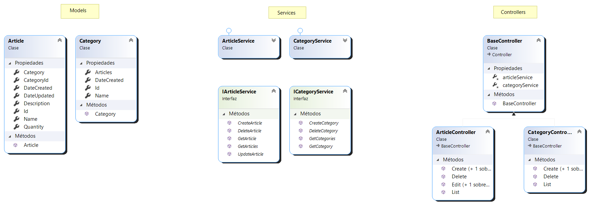
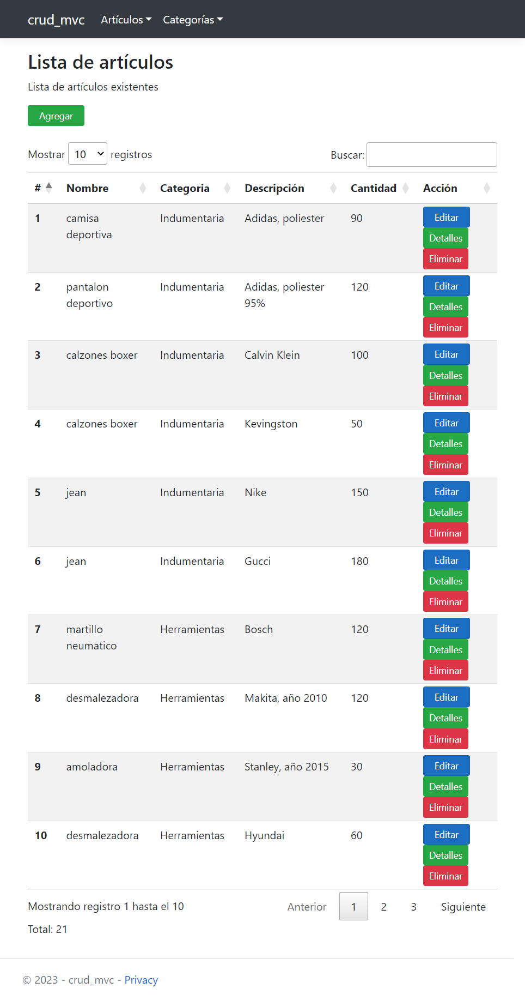
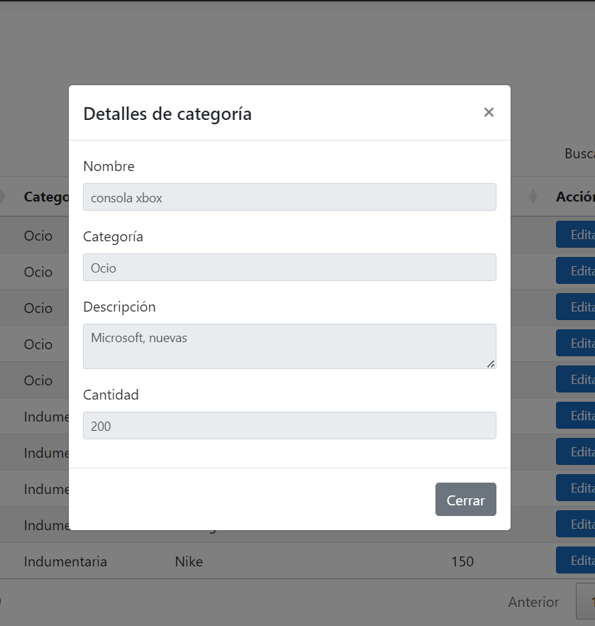

# Crud MVC

 Sistema básico con operaciones CRUD (escritura, lectura, edición y borrado de información) 
 sobre una base de datos SQL Server hecho en .Net Core 3.1 y Entity Framework.

## ¿De qué trata esta aplicación?

Este proyecto consiste en un pequeño sistema de inventario con una base de datos 
lista para usar y lógica de negocio mínima. 
Todos los componentes usados se listan a continuación.

  - [Entity Framework Core 3.1.0](https://www.nuget.org/packages/Microsoft.EntityFrameworkCore/3.1.0) (back-end)
  - [datatables 1.13.3](https://datatables.net/) (front-end)
  - [FluentValidation.AspNetCore 11.0.0](https://www.nuget.org/packages/FluentValidation.AspNetCore/11.0.0) (back-end/front-end)

## ¿Cómo pruebo esto? (Despliegue)

Para poder ejecutar la aplicación (por el momento solo en sistemas Windows) se necesita instalar los 
siquientes componentes:

  - [SQL Server Express LocalDB](https://learn.microsoft.com/en-us/sql/database-engine/configure-windows/sql-server-express-localdb?view=sql-server-ver16)
  - [Runtime de Net Core 3.1](https://dotnet.microsoft.com/en-us/download/dotnet/3.1)
  - Navegador Web (cualquiera).

Una vez instalados, seguir los siguientes pasos para iniciar el proyecto.

  1. Descargar el proyecto compilado listo para probar desde [este enlace](https://github.com/manuel-chinchi/crud-mvc-dotnet/releases/tag/release/crud_mvc_dotnet_v1.0.zip).

  2. Descomprimir los archivos del proyecto en alguna carpeta, por ej. crear una carpeta
  en el escritorio llamada `ExampleProject`.
  
  3. Pararse dentro de esa carpera. Para esto, abrir una terminal y ejecutar el 
  comando `cd C:\Users\%username%\Desktop\ExampleProyect\`.
  
  4. Antes de iniciar el proyecto cambiar la conexión para que "apunte" a la base de datos
  que trae dentro de la carpeta `App_Data`. Para esto, abrir el archivo `appsettings.json`
  y dejarlo como se muestra a continuación:
      ```json
      {
        "Logging": {
          "LogLevel": {
            "Default": "Information",
            "Microsoft": "Warning",
            "Microsoft.Hosting.Lifetime": "Information"
          }
        },
        "AllowedHosts": "*",
        "ConnectionStrings": {
          // develop
          //"DefaultConnection": "Server=(localdb)\\mssqllocaldb; Database=crud_mvc_dotnet; Trusted_Connection=True;"
          // deploy in other machine
          "DefaultConnection": "Server=(localdb)\\mssqllocaldb; Database=crud_mvc_dotnet; Trusted_Connection=True; AttachDbFilename=|DataDirectory|\\App_Data\\crud_mvc_dotnet.mdf"
        }
      }
      ```  
      Lo que se hace acá es solamente cambiar el valor del **ConnectionStrings** para que lea
      la base de datos desde `App_Data\crud_mvc_dotnet.mdf` que se encuentra en el proyecto.
  
  5. Iniciar el proyecto, en la terminal ejecutar el comando `dotnet crud.dll`, deberan 
  mostrarse unas lineas y entre esas una url de navegación similar a esta `https://localhost:5001`.

  6. Abrir el navegador e ir a la url anteriormente mostrada y listo, ya se puede probar
  la aplicación.

## Arquitectura de la aplicación

La aplicación cuenta con una estructura tipo MVC (Modelo-Vista-Controlador). Además implementa 
una capa de servicios para el acceso a datos. **Todo esto en un mismo proyecto**. 
Para una vista general, se presenta el diagrama de clases (archivo `ClassDiagram.cd`)



## Capturas

Pagina de lista de artículos.

<!--  -->
<p align="center">
  
</p>

Página de detalles de un artículo.

<!--  -->
<p align="center">
  
</p>

## Demostración

https://user-images.githubusercontent.com/88981972/233879807-b1d2f422-6fdb-4d00-b366-6c6c44391dc6.mp4
